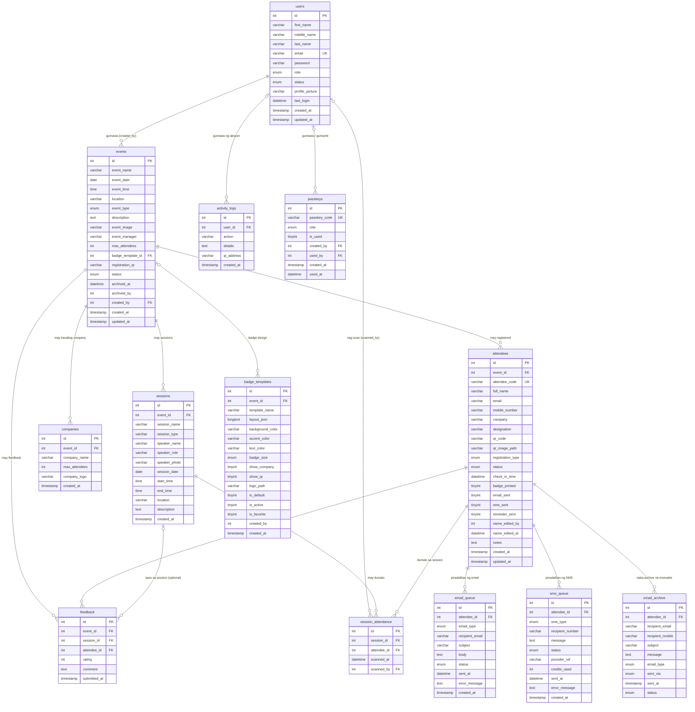

# Entity Relationship Diagram (ERD)

Full Circle Events Asia, Inc. : Event Check-in System. Database: `full_event_db` (MariaDB 10.4), 13 tables, 17 foreign keys.

Kinuha ito diretso sa live database (information_schema), kaya tugma sa code. Ang larawan para sa paper ay `ERD.png` sa folder na ito. Kapag nagbago ang schema (bagong migration), i-update ang diagram na ito at ang `ERD.png`.

Basa ng mga simbolo: `||` eksaktong isa, `|o` zero o isa, `o{` zero o marami. PK = primary key, FK = foreign key, UK = unique.

## Relationships

| Parent | Child | FK column | Cardinality | Kapag binura ang parent |
|---|---|---|---|---|
| users | events | `created_by` | 1 : N | SET NULL (maiiwan ang event) |
| users | activity_logs | `user_id` | 1 : N | SET NULL (maiiwan ang log) |
| users | passkeys | `created_by`, `used_by` | 1 : N | SET NULL |
| users | session_attendance | `scanned_by` | 1 : N | SET NULL |
| events | attendees | `event_id` | 1 : N | CASCADE |
| events | companies | `event_id` | 1 : N | CASCADE |
| events | sessions | `event_id` | 1 : N | CASCADE |
| events | badge_templates | `event_id` (nullable: global template kung NULL) | 0..1 : N | CASCADE |
| badge_templates | events | `events.badge_template_id`: design na ipi-print sa badges ng event (NULL = favorite design) | 0..1 : N | SET NULL |
| events | feedback | `event_id` | 1 : N | CASCADE |
| attendees | feedback | `attendee_id` | 1 : N | CASCADE |
| sessions | feedback | `session_id` (NULL = feedback sa buong event) | 0..1 : N | CASCADE |
| sessions | session_attendance | `session_id` | 1 : N | CASCADE |
| attendees | session_attendance | `attendee_id` | 1 : N | CASCADE |
| attendees | email_queue | `attendee_id` | 1 : N | CASCADE |
| attendees | sms_queue | `attendee_id` | 1 : N | CASCADE |
| attendees | email_archive | `attendee_id` | 1 : N | CASCADE |

`session_attendance` ay ang associative table ng many-to-many na **attendees ↔ sessions** (isang attendee, maraming session; isang session, maraming attendee).

## Data dictionary (buod)

| Table | Laman | Mahalagang rules |
|---|---|---|
| users | Accounts ng Super Admin, Admin at Staff | `email` unique; password naka-bcrypt; 5 maling password -> `locked_until` = 15 minuto (`failed_logins` ang bilang) |
| passkeys | Codes para makapag-register ng bagong account at role | `passkey_code` unique; `is_used` para isang beses lang magamit |
| events | Events: petsa, oras, lugar, status, badge design | status: upcoming → ongoing → completed → archived; `badge_template_id` NULL = favorite design ang gamit |
| companies | Mga company na kasali sa event at ang attendee limit nila | `max_attendees` NULL = walang limit |
| attendees | Registered at walk-in na attendees, QR code, check-in status | `attendee_code` unique; isang email lang bawat event (`event_id` + `email`) |
| sessions | Talks o breakouts sa loob ng event | |
| session_attendance | Sino ang na-scan sa bawat session | isang record lang bawat attendee bawat session |
| feedback | Rating (1–5) at comment ng attendee | isang feedback bawat attendee bawat session |
| email_queue | Log ng bawat email (QR, reminder, feedback): sent o failed | ginagamit ng automation para hindi magpadala ng doble |
| sms_queue | Log ng bawat SMS, kasama ang Semaphore reference at credits | ginagamit ng automation para hindi magpadala ng doble |
| email_archive | Archive ng mga mensahe ng na-archive na event | |
| badge_templates | Mga design mula sa Badge Designer | `layout_json` ang laman ng design |
| activity_logs | Audit trail: login, check-in, imports, account changes | |

## Mga link na hindi naka-foreign key

Ang mga ito ay tumuturo sa ibang table pero walang FK constraint sa database (by design o legacy):

- `attendees.company` ↔ `companies.company_name` (tugma sa pangalan, hindi sa id; para gumana rin ang company na tina-type lang sa CSV)
- `attendees.name_edited_by`, `events.archived_by`, `badge_templates.created_by` → `users.id`
